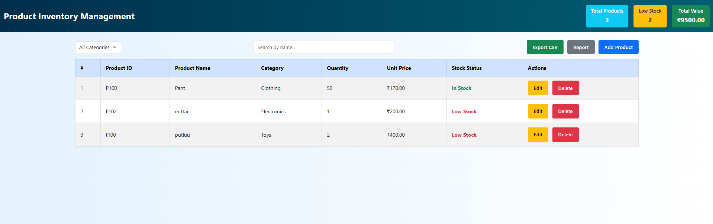

# Product Inventory Management

Product inventory management is used for tracking, organizing, and managing products, stock levels, and their details efficiently.

Check it out here: [Live Demo](https://kiruthikasankarr.github.io/Product-Inventory-management/)

Or click the image to visit the live demo:

